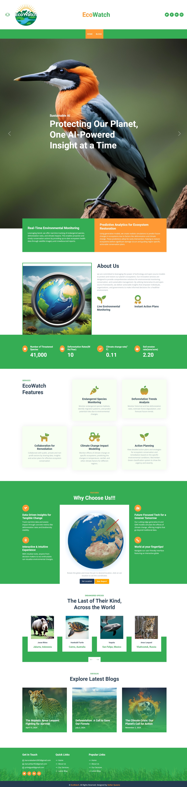
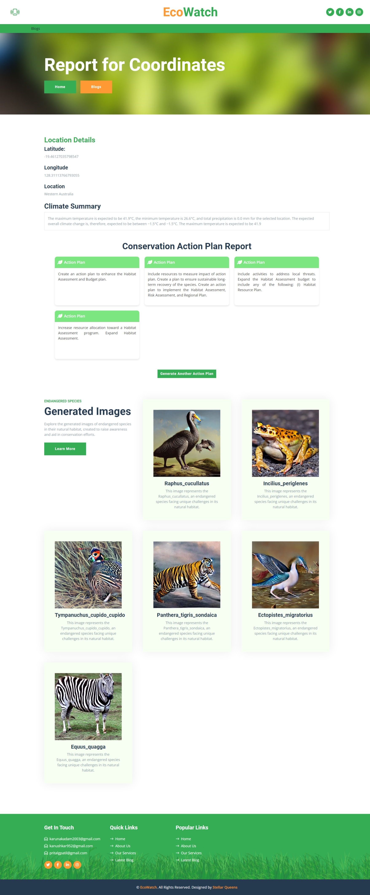
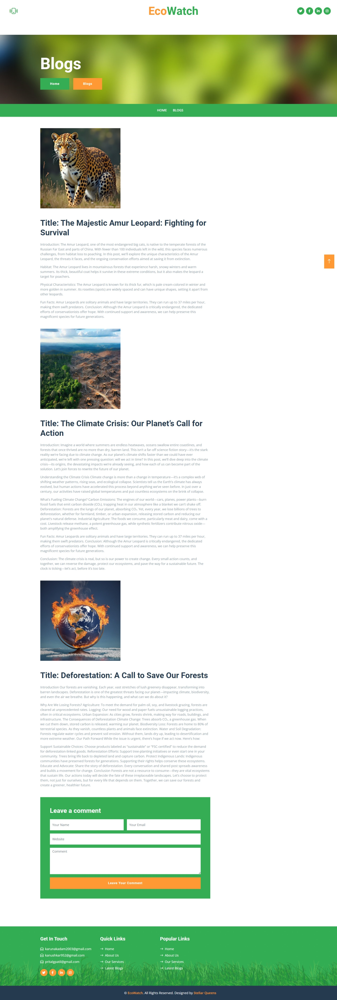

# EcoWatch

Tackling Ecosystem Degradation with GenAI: A Revolutionary Approach to Environmental Conservation


## Documentation


### Introduction
EcoWatch is an advanced web-based platform leveraging Generative AI (GenAI) to monitor and address environmental conditions across various locations. The tool uses AI-powered models to generate climate summaries, formulate actionable environmental remediation plans, and visualize environmental challenges through generated images. This innovative approach aims to tackle ecosystem degradation effectively, offering scalable and data-driven solutions to preserve our planet.

### Core Functionality
EcoWatch provides the following capabilities:

Location-Based Environmental Monitoring: Collects and analyzes environmental data like climate data, endangered species data,etc. specific to various geographical locations.

Automated Action Plans: Uses AI models to draft targeted action plans for environmental remediation.

Visual Environmental Representations: Generates illustrative images of endangered species to aid in visual understanding and advocacy.

### Key Modules and Libraries Used
#### 1. Flask and Related Modules
flask: A lightweight web framework for building the EcoWatch web interface.

Flask: Core class used to create the web application.

render_template: Utilized for rendering HTML templates in the frontend.

request: Handles and processes incoming data from client-side requests.

jsonify: Converts data to JSON format for API responses, ensuring structured and easy data transfer.

#### 2. Library for Location
Geopy: Specifically, the Nominatim geocoder from the geopy.geocoders module is used for converting addresses into geographic coordinates (latitude and longitude) and vice versa. It allows easy access to geographic data for various applications, such as mapping and location-based services.

Deep Translator: The GoogleTranslator class from the deep_translator library is employed to facilitate translation services within the application. It uses Google Translate's API to provide reliable translations between multiple languages, enhancing accessibility and user experience.

#### 3. Transformers Library
transformers: A state-of-the-art library for natural language processing (NLP) tasks, which powers text generation and understanding.

AutoModelForCausalLM: Loads pre-trained causal language models for text generation.

AutoTokenizer: Preprocesses and tokenizes text to make it compatible with models for efficient inference.

#### 4. Regular Expressions
re: A built-in library to work with regular expressions, used for text pattern matching and data extraction.

#### 5. Requests Library
requests: A simple and powerful HTTP library for sending API requests to external services or endpoints, facilitating data retrieval.

#### 6. PyTorch
torch: A robust library for tensor operations and deep learning. It serves as the backend for model computations, supporting efficient training and inference.

#### 7. Diffusers Library
diffusers: A specialized library for implementing and running diffusion models, such as Stable Diffusion, for image generation.

StableDiffusionPipeline: The primary class used to load and execute the Stable Diffusion model, generating environmental images to illustrate data insights.


### AI Models from Hugging Face Model Hub
EcoWatch uses several pre-trained models from Hugging Face's Model Hub for text generation and image creation:

#### Text Generation Models:

EleutherAI/gpt-neo-125M: Generates concise and informative climate summaries based on input data.

gpt2: Used for generating coherent and actionable environmental plans tailored to specific regions or issues.

#### Image Generation Model:

Stable Diffusion:
Model ID: "CompVis/stable-diffusion-v1-4": A powerful generative model used to create realistic and context-relevant images that visualize environmental conditions or predicted impacts.
## API Reference

#### globe.gl

API to represent data visualization layers on a 3-dimensional globe in a spherical projection.

#### gbif.org

Fetches endangered species for give location(latitude and longitude)


#### open-meteo

Fetches weather details for give location(latitude and longitude)
## Run Locally

Clone the project

```bash
  git clone https://github.com/Anushka952/EcoWatch.git
```

Go to the project directory

```bash
  cd EcoWatch
```

Install dependencies

```bash
  pip install -r requirements.txt
```

Run the app

```bash
  python app.py
```

Open http//:127.0.0.1:5000 to view the web app


## Screenshots

#### Home Page


#### Reports Page



#### Blogs page



## Demo

[Demo video.mp4](https://drive.google.com/file/d/1b7Gfqx77HhoGqinaKVOCwm-IWOxWI7BA/view?usp=sharing)


## Authors

- [Karuna Kadam](https://github.com/karunakadam2003)

- [Anushka Karambelkar](https://github.com/Anushka952)

- [Prital Patil](https://github.com/pritalpatil)
